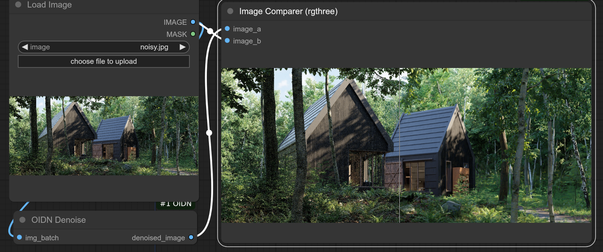

# ComfyUI-OIDN
a wrapper for OIDN image denoiser in ComfyUI. This denoiser gives the best results on RT generated image noise.

<hr>
WARNING!  : this is a development repo, usage in production environments is not advised! Bugs are to be expected.
<hr>

# Install
Just use comfyui manager, or:

```
  cd ComfyUI/custom_nodes
  git clone https://github.com/Anze-/ComfyUI-OIDN.git
  cd ComfyUI-OIDN
  pip install -r requirements.txt
```
NOTE: the image contains a basic workflow.

# Credits
All credits and licensing for OIDN and oidn python wrapper go to:
[OIDN-python](https://github.com/sxysxy/OIDN-python) , 
[oidn](https://github.com/RenderKit/oidn)

